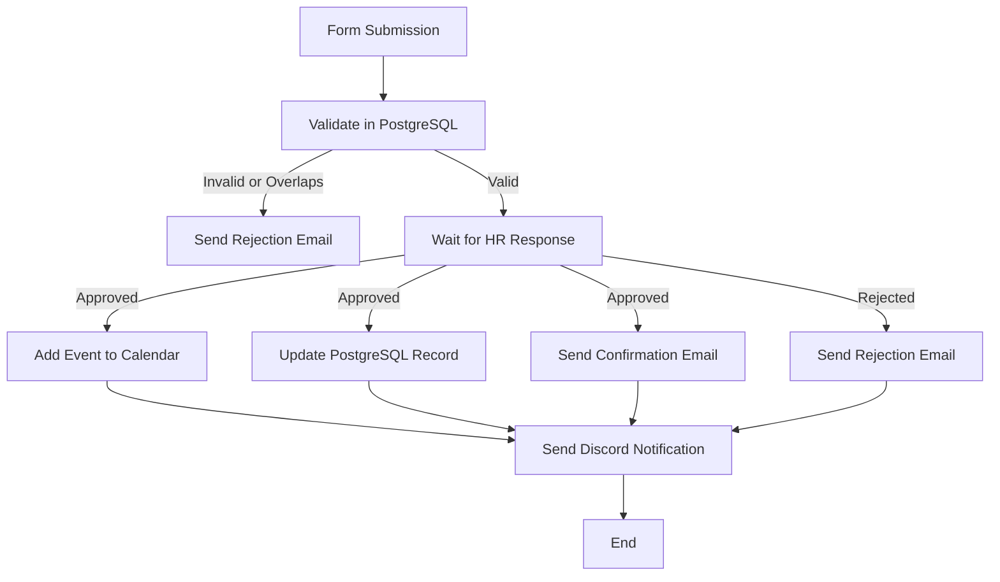

#  n8n Vacation Request Automation

This project automates the **employee vacation request process** using **n8n**, integrating multiple systems such as **PostgreSQL**, **Discord**, **email**, and **calendar services**.

---

##  Overview

The workflow is designed to handle the full lifecycle of a vacation request — from form submission to HR approval, notifications, and final confirmation.  
It leverages **n8n’s no-code/low-code capabilities** and uses **Wait nodes** to handle asynchronous approval responses.

---

##  Workflow Steps

1. **Form Submission**  
   The process starts when an employee submits a vacation request form through n8n.

2. **Validation in PostgreSQL**  
   The workflow connects to a PostgreSQL database to:
   - Validate if the employee already has overlapping vacation dates.  
   - Verify the total number of available vacation days.

3. **Request Evaluation**  
   - If the vacation is invalid or exceeds the employee’s available days, an **email notification** is sent to inform that the request was **rejected**.
   - Otherwise, the process continues and waits for HR’s response.

4. **HR Approval (Wait Node)**  
   The workflow uses a **Wait node** to pause execution until HR provides an approval or rejection response.

5. **HR Decision Handling**  
   - If **approved**, the system:
     - Adds the vacation event to the **corporate calendar**.
     - Updates the employee’s vacation record in PostgreSQL.
     - Sends a **confirmation email** to the employee.
   - If **rejected**, the system sends a **rejection notification** via email and logs the decision.

6. **Discord Notification**  
   A message is automatically posted to a Discord channel to inform the team about the approval or rejection of the vacation request.

---

##  Technologies Used

- **[n8n](https://n8n.io/)** – Workflow automation platform  
- **PostgreSQL** – Employee data and vacation tracking  
- **Email** – Notifications for approval/rejection  
- **Discord Webhooks** – Internal team communication  
- **Calendar Integration** – Adds approved vacations to shared calendars  
- **Wait Nodes** – Pause workflow until HR responds  

---

## Key Features

- Fully automated vacation request management  
- Seamless integration between database, email, and collaboration tools  
- Asynchronous approval handling with `Wait` nodes  
- Automatic database updates and calendar event creation  
- Centralized notifications via email and Discord  

---

## Example Use Case

1. Employee submits vacation request via form.  
2. System validates request in PostgreSQL.  
3. HR is notified and reviews the request.  
4. Workflow waits for HR’s decision.  
5. Depending on HR’s response:
   - The database and calendar are updated.
   - Employee receives an email confirmation or rejection.
   - A Discord notification is sent to the team.

---

##  Requirements

- n8n instance (self-hosted or cloud)  
- PostgreSQL database connection  
- Configured email credentials (SMTP or API-based)  
- Discord webhook URL  
- Calendar integration credentials (e.g., Google Calendar API)

---

##  Workflow Diagram

---

##  License

This project is licensed under the **MIT License** – feel free to use and adapt it.

---

 **Made with ❤️ by Anselmo Pelcastre**
